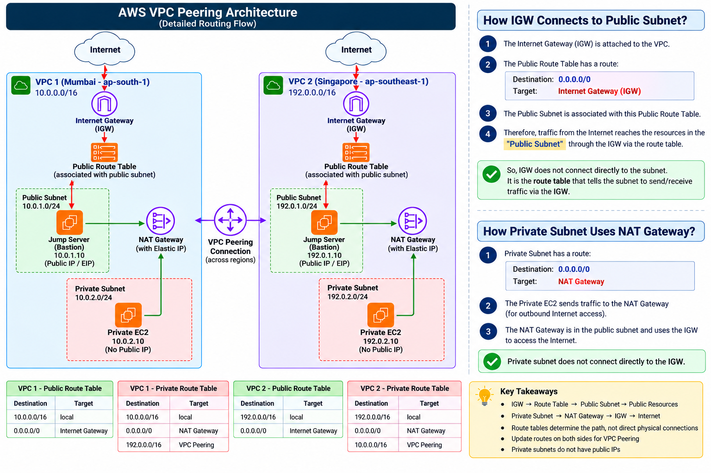

# AWS Multi-Region VPC Peering & Private EC2 Connectivity

## Project Overview

This project demonstrates a multi-region AWS networking environment using two VPCs connected through a VPC Peering Connection.

The architecture demonstrates:
- Public and private subnet design
- Internet Gateway and NAT Gateway
- Public and private route tables
- Jump Server / Bastion Host
- Private EC2 instances
- Cross-region VPC Peering
- Private EC2-to-EC2 communication
- SSH access to private EC2 instances
- Route-table based traffic forwarding
- Packet-level traffic analysis
- Network troubleshooting

## Architecture



### VPC 1 — Mumbai
- Region: `ap-south-1`
- VPC CIDR: `10.0.0.0/16`

### VPC 2 — Singapore
- Region: `ap-southeast-1`
- VPC CIDR: `192.0.0.0/16`

> Replace the VPC 2 CIDR if your actual lab used a different range. The VPC CIDRs must be non-overlapping.

## Network Design

Each VPC contains a public subnet and a private subnet.

The public subnet contains the Jump Server. The private subnet contains the private EC2.

```text
VPC 1 — Mumbai
10.0.0.0/16
      |
      | VPC Peering
      |
VPC 2 — Singapore
192.0.0.0/16
```

## Public Subnet

The public subnet is associated with a public route table containing a default route to the Internet Gateway.

```text
Destination       Target
--------------------------------
10.0.0.0/16       local
0.0.0.0/0         Internet Gateway
```

## Private Subnet

The private subnet contains the private EC2. It does not require a public IP.

Example VPC 1 private route table:

```text
Destination        Target
--------------------------------------
10.0.0.0/16        local
0.0.0.0/0          NAT Gateway
192.0.0.0/16       VPC Peering
```

## Internet Gateway

Public resources use the Internet Gateway through the public route table:

```text
Internet → Internet Gateway → Public Route Table → Public Subnet → Jump Server
```

The private EC2 does not directly use the Internet Gateway for outbound Internet access.

## NAT Gateway

The NAT Gateway is deployed in the public subnet and provides outbound Internet access for private resources.

```text
Private EC2
   |
Private Route Table
   |
   | 0.0.0.0/0
   v
NAT Gateway
   |
Internet Gateway
   |
Internet
```

## Jump Server / Bastion Host

```text
Remote User
     |
     | SSH
     v
Jump Server
     |
     | SSH using private IP
     v
Private EC2
```

## VPC Peering

A VPC Peering Connection was established between the two VPCs.

Creating the peering connection alone does not automatically create routes. Routes must be configured on both sides.

VPC 1:
```text
192.0.0.0/16 → VPC Peering
```

VPC 2:
```text
10.0.0.0/16 → VPC Peering
```

## Traffic Flow Summary

| Source | Destination | Path |
|---|---|---|
| Remote User | VPC 1 Private EC2 | Internet → IGW → Jump Server → Private EC2 |
| Remote User | VPC 2 Private EC2 | Internet → IGW → Jump Server → Private EC2 |
| VPC 1 Private EC2 | VPC 2 Private EC2 | VPC Peering |
| VPC 1 Private EC2 | VPC 2 Jump Server private IP | VPC Peering |
| Private EC2 | Internet | NAT Gateway → IGW → Internet |

Detailed packet flows are documented under `traffic-flows/`.

## Route Selection

AWS selects the most specific matching route.

```text
Destination        Target
--------------------------------------
10.0.0.0/16        local
192.0.0.0/16       VPC Peering
0.0.0.0/0          NAT Gateway
```

Traffic to `192.0.x.x` uses VPC Peering.

Traffic to an Internet destination such as `8.8.8.8` uses the default route and is sent to the NAT Gateway.

## Security Considerations

- Keep private EC2 instances without public IPs.
- Allow SSH to the Jump Server only from trusted administrator IPs.
- Allow SSH to private EC2 only from the appropriate internal source.
- Allow only required protocols and ports between the VPC CIDRs.
- Review Security Groups and Network ACLs during troubleshooting.
- Follow least-privilege access.

## Verification

```bash
ip addr
ip route
ping <destination-private-ip>
ssh -v user@<private-ip>
nc -zv <destination-ip> 22
traceroute <destination-ip>
```

Cross-VPC private connectivity was successfully tested between the private EC2 instances.

## Key Learnings

- AWS VPC architecture
- CIDR addressing
- Public vs private subnets
- Route tables
- Internet Gateway
- NAT Gateway
- Jump Server / Bastion Host
- VPC Peering
- Cross-region private connectivity
- Private IP routing
- TCP/SSH and ICMP traffic
- Route selection
- Network troubleshooting

## Future Enhancements

- Multi-AZ deployment
- NAT Gateway per Availability Zone
- Terraform or CloudFormation
- VPC Flow Logs
- CloudWatch monitoring
- AWS Systems Manager Session Manager
- AWS Transit Gateway for larger multi-VPC environments
- Centralized logging and security monitoring

## Final Outcome

Successfully built two AWS VPC environments in different regions and established private communication between them using VPC Peering.

### Remote Administration
```text
Remote User → Jump Server → Private EC2
```

### Cross-VPC Communication
```text
VPC 1 Private EC2 → VPC Peering → VPC 2 Private EC2
```

### Private Subnet Internet Access
```text
Private EC2 → Private Route Table → NAT Gateway → IGW → Internet
```

### Core Takeaway

> Route tables determine the traffic path.
>
> Internet Gateway provides Internet connectivity for public resources.
>
> NAT Gateway provides outbound Internet access for private resources.
>
> VPC Peering provides private connectivity between VPCs.
>
> Jump Servers provide controlled administrative access to private instances.


# NOTE : The Jump Server does not use the NAT Gateway to reach the private EC2. The Jump Server and private EC2 communicate using private VPC routing. The NAT Gateway is used when the private subnet needs outbound Internet access.
